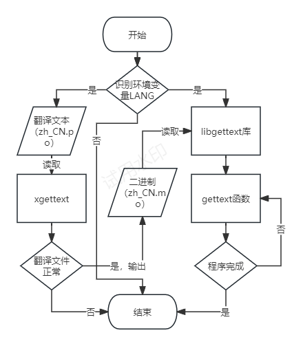

# gettext

My cool new project!

非英文母语国家需要一个支持国际化翻译的 Fortran 库。本库提供了 xgettext 和 gettext 两个接口：
* xgettext负责提取字符串，生成.mo二进制文件。
* libgettext负责解析二进制文件，在运行时翻译。



```sh
fpm run --example xgettext
fpm run --example example_read
```

## TODO

* 保留字符串后面的空格符号，需要使用其它符号标记。
* 隐藏哈希表细节。
* 识别环境变量 LANG。

## 存在的问题

Fpm启用GFortran编译选项`-fcoarray=single`将发生报错。
